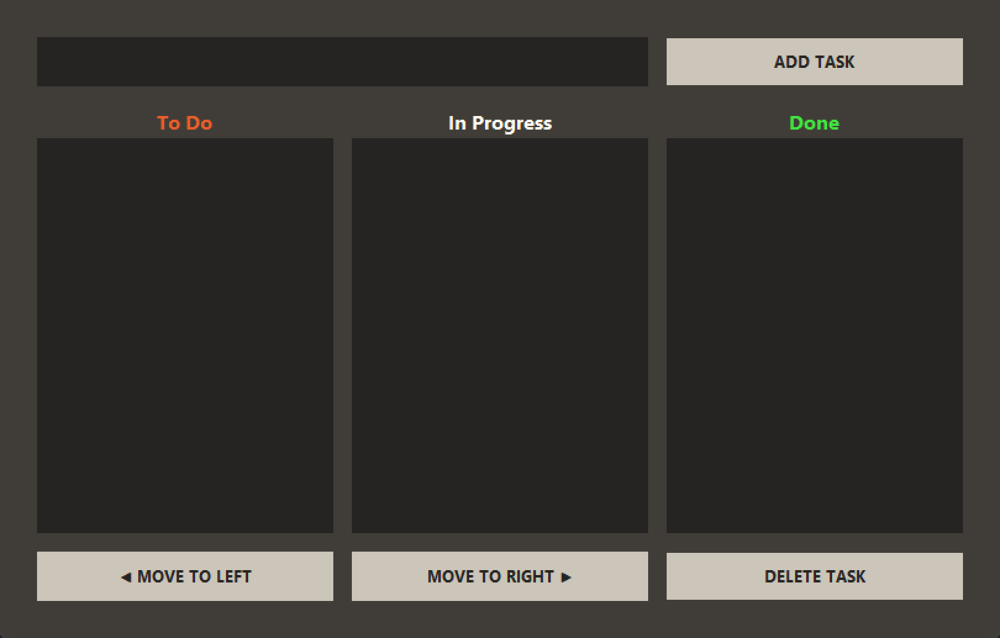
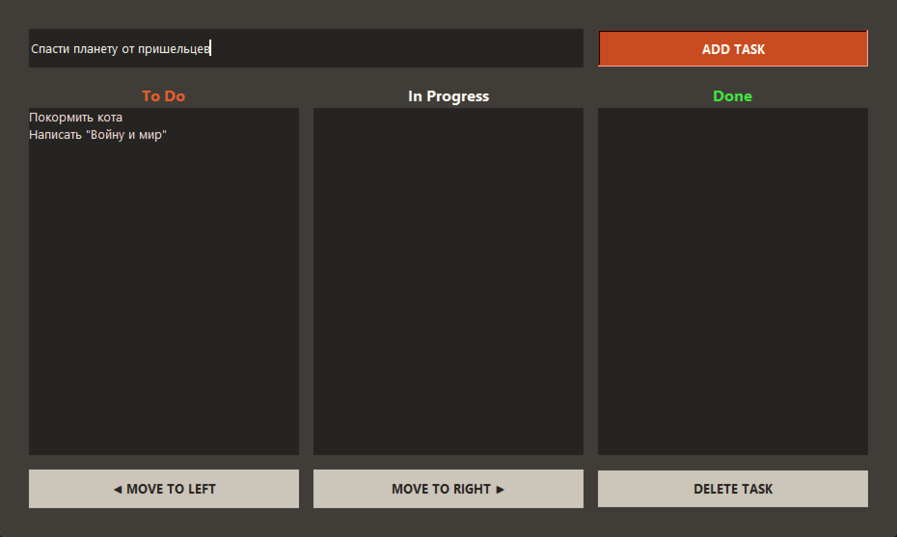
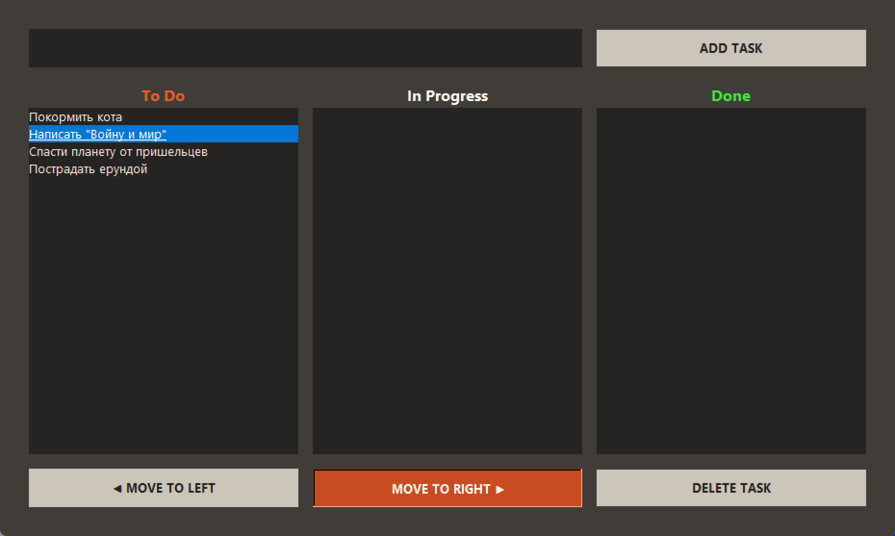
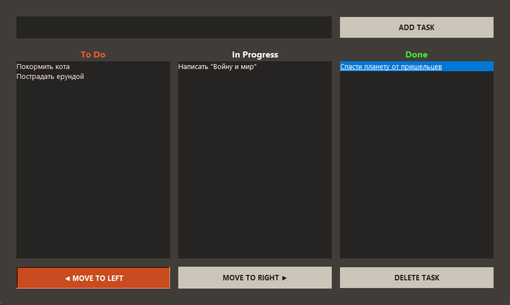
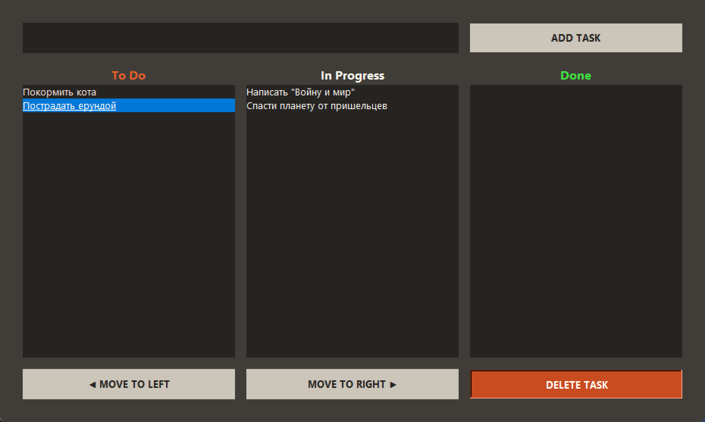
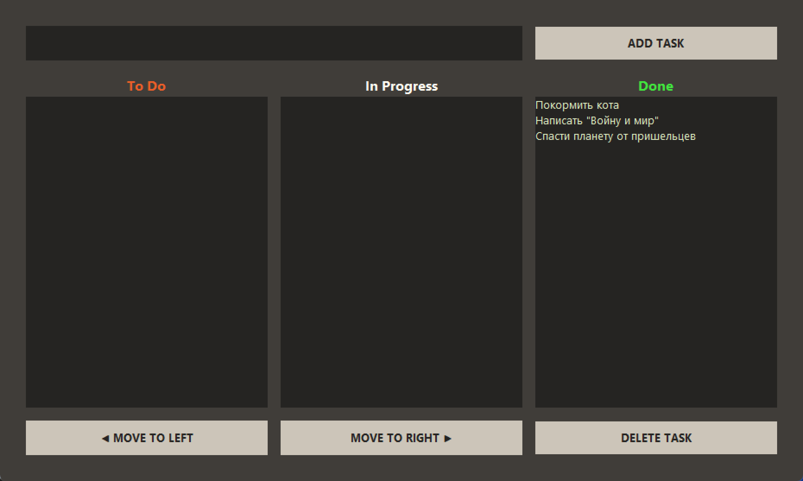

# Скриншоты приложения

Здесь собраны визуальные примеры работы канбан-трекера. Все изображения актуальны для версии [1.0].

## Список файлов

### 1. Основной интерфейс
`main-view.png`  
  
*Главное окно приложения с тремя колонками*

### 2. Добавление задачи
`add-task.png`  
  
*Процесс создания новой задачи*

### 3. Перемещение задачи вправо
`move-right.png`  
  
*Процесс перемещения задачи в колонку правее*

### 4. Перемещение задачи влево
`move-left.png`  
  
*Процесс перемещения задачи в колонку левее*

### 5. Удаление задачи
`delete-task.png`  
  
*Процесс удаления выделенной задачи*

### 6. Все задачи выполнены
`all-done.png`  
  
*Вид интерфейса со всеми выполненными задачами*
